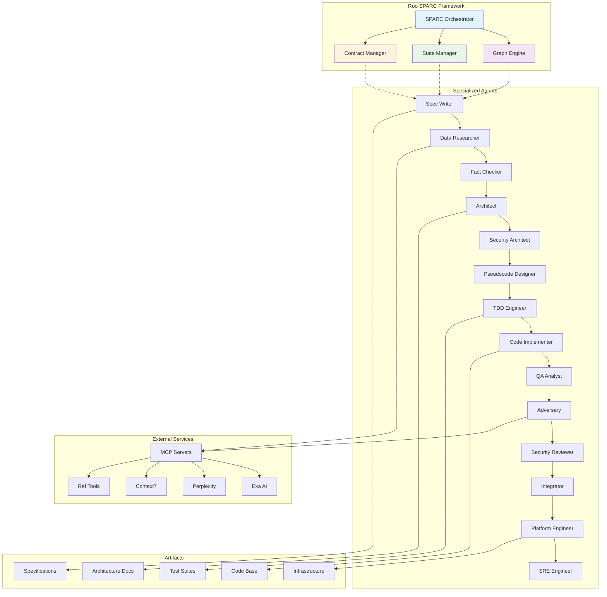
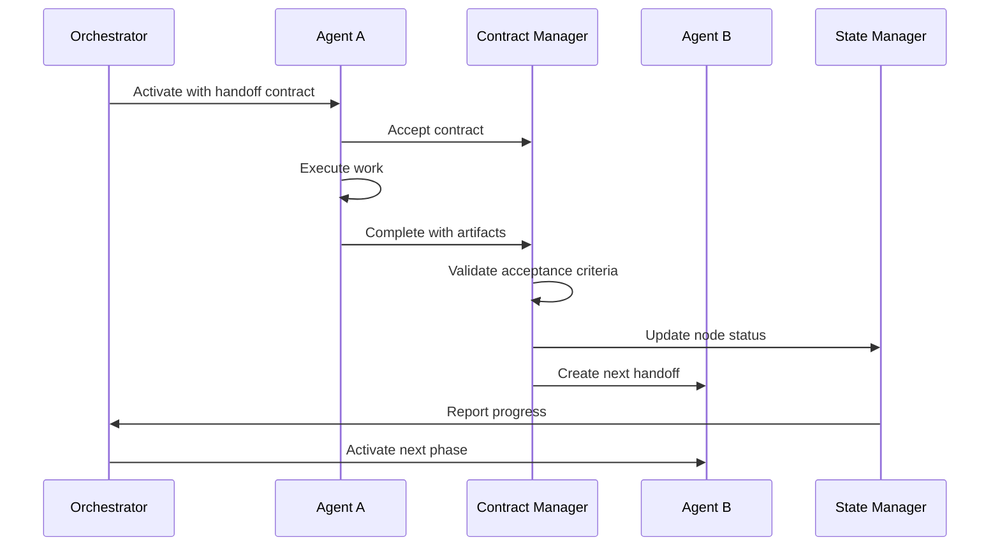
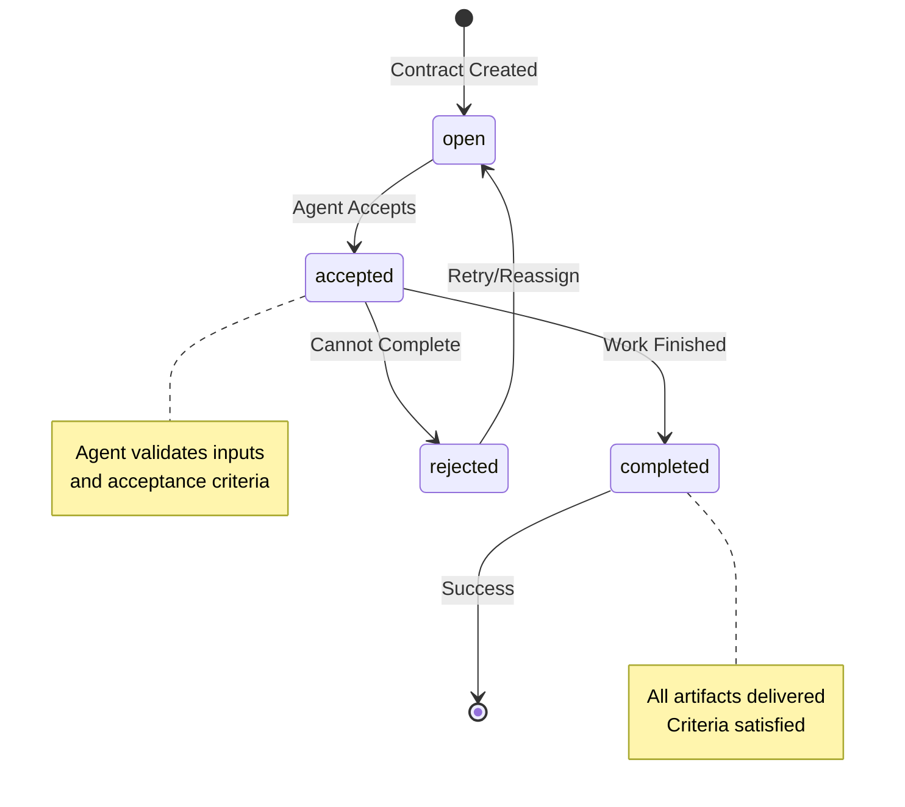

# 🚀 Roo SPARC—Agile—DevOps Boomerang Starter

[](https://github.com) [](https://semver.org/) [](LICENSE) [](https://docs.anthropic.com)

**A revolutionary AI-orchestrated development framework that automates the entire software development lifecycle through specialized agents and formal contract handoffs.**

---

## 📋 Table of Contents

- [🎯 Overview](#-overview)
- [✨ Key Features](#-key-features)
- [🏗️ Architecture](#️-architecture)
- [🔄 SPARC Workflow](#-sparc-workflow)
- [📄 Contract System](#-contract-system)
- [⚡ Quick Start](#-quick-start)
- [🛠️ Installation](#️-installation)
- [📖 Usage Guide](#-usage-guide)
- [📁 Project Structure](#-project-structure)
- [🔧 Configuration](#-configuration)
- [👥 Development](#-development)
- [🤝 Contributing](#-contributing)
- [📚 Additional Resources](#-additional-resources)

## 🎯 Overview

The Roo SPARC—Agile—DevOps Boomerang Starter is a **turnkey AI-orchestrated development framework** that revolutionizes software engineering through intelligent automation. By combining the SPARC methodology with Agile practices and DevOps automation, this system enables autonomous development workflows where specialized AI agents handle different phases of the software development lifecycle.

### What Makes This Special?

- **🤖 AI-First Development**: Specialized AI agents handle requirements, architecture, coding, testing, and deployment
- **📋 Contract-Driven Handoffs**: Formal contracts ensure quality and continuity between development phases  
- **🔄 Complete SDLC Automation**: From specification to production deployment in one orchestrated workflow
- **🎯 Agile Integration**: Built-in sprint management, backlogs, and iterative development support
- **🛡️ Security-First**: Integrated threat modeling, adversarial testing, and security reviews
- **📊 Observable by Design**: Comprehensive state tracking, logging, and progress monitoring

## ✨ Key Features

- **Graph-Based Orchestration** - Visual workflow definition with dependency management
- **Specialized AI Modes** - 15+ specialized agents for different development phases
- **Contract System** - Formal handoff contracts with acceptance criteria and artifact tracking
- **State Management** - Real-time workflow state with persistence and recovery
- **MCP Integration** - Model Context Protocol services configured within Roo Code configured in Roo Code
- **Agile Tooling** - Sprint planning, backlog management, and story tracking
- **DevOps Automation** - Infrastructure as Code, CI/CD, and SRE practices
- **Security Integration** - Threat modeling, security architecture, and adversarial testing
- **Quality Assurance** - Automated testing, QA workflows, and acceptance testing

## 🏗️ Architecture

### System Overview



### Contract-Driven Handoffs



## 🔄 SPARC Workflow

The system implements a comprehensive Software Development Lifecycle through the SPARC methodology enhanced with security, quality, and operations phases:

```mermaid
flowchart TD
    Start([Project Start]) --> Spec[📋 Specification Writer]
    Spec --> Research[🔍 Data Researcher]
    Research --> FactCheck[✅ Fact Checker]
    FactCheck --> Arch[🏛️ Architect]
    Arch --> SecArch[🛡️ Security Architect]
    SecArch --> Pseudo[📝 Pseudocode Designer]
    Pseudo --> TDD[🧪 TDD Engineer]
    TDD --> Impl[💻 Code Implementer]
    Impl --> QA[🔍 QA Analyst]
    QA --> Adversary[⚔️ Adversary Tester]
    Adversary --> Reviewer[🔍 Security Reviewer]
    Reviewer --> Integrate[🔗 Integrator]
    Integrate --> Platform[☁️ Platform Engineer]
    Platform --> SRE[📊 SRE Engineer]
    SRE --> Complete([Production Ready])
    
    subgraph "Phase Groups"
        direction TB
        subgraph "Planning"
            Spec
            Research
            FactCheck
        end
        
        subgraph "Design"
            Arch
            SecArch
            Pseudo
        end
        
        subgraph "Development"
            TDD
            Impl
            QA
        end
        
        subgraph "Security & Quality"
            Adversary
            Reviewer
        end
        
        subgraph "Deployment"
            Integrate
            Platform
            SRE
        end
    end
    
    style Planning fill:#e1f5fe
    style Design fill:#f3e5f5
    style Development fill:#e8f5e8
    style "Security & Quality" fill:#fff3e0
    style Deployment fill:#fce4ec
```

### Phase Descriptions

| Phase | Agent | Purpose | Key Outputs |
|-------|-------|---------|-------------|
| **Specification** | `sparc-specification-writer` | Requirements gathering and specification | `specification.md`, `acceptance-criteria.md` |
| **Research** | `data-researcher` | Collect decision-grade sources & claims | Research artifacts, market analysis |
| **Fact Check** | `rapid-fact-checker` | Verify claims (≥95% accuracy for autonomy-critical) | Verified facts, risk assessment |
| **Architecture** | `sparc-architect` | System design and component architecture | `architecture.md`, component diagrams |
| **Security Architecture** | `sparc-security-architect` | Threat modeling and security design | `threat-model.md`, `security-architecture.md` |
| **Pseudocode** | `sparc-pseudocode-designer` | Detailed algorithm design | `pseudocode.md`, function specifications |
| **TDD** | `sparc-tdd-engineer` | Test-driven development setup | Failing tests, coverage targets |
| **Implementation** | `sparc-code-implementer` | Code development per specifications | Production code, unit tests |
| **QA** | `sparc-qa-analyst` | Quality assurance and testing | QA plan, `acceptance-test-results.md` |
| **Adversary** | `sparc-autonomous-adversary` | Red team testing and risk assessment | Vulnerability assessment, evidence |
| **Security Review** | `security-reviewer` | Security audit and compliance | Security audit reports, SARIF |
| **Integration** | `sparc-integrator` | System integration and delivery | `integration-report.md`, delivery checks |
| **Platform** | `sparc-platform-engineer` | Infrastructure and deployment | IaC, CI/CD, observability configs |
| **SRE** | `sparc-sre-engineer` | Production readiness | SLI/SLOs, alerts, runbooks |

## 📄 Contract System

The framework uses formal contracts to ensure quality handoffs between development phases:

```mermaid
classDiagram
    class HandoffContract {
        +string schema
        +string handoff_id
        +string parent_id
        +FromAgent from
        +ToAgent to
        +string objective
        +string[] inputs
        +string[] acceptance_criteria
        +string[] artifacts
        +string[] dependencies
        +string ttl
        +NextStep[] next
        +string status
        +validateContract()
        +executeHandoff()
    }
    
    class FromAgent {
        +string mode
        +string agent
        +datetime timestamp
    }
    
    class ToAgent {
        +string mode
        +string agent
        +datetime timestamp
    }
    
    class NextStep {
        +string target_mode
        +string intent
    }
    
    class StateManager {
        +string schema
        +string project_id
        +datetime updated_at
        +string current
        +NodeStatus[] nodes
        +string[] active
        +string[] completed
        +string[] failed
        +updateNodeStatus()
        +getCurrentPhase()
        +getProgress()
    }
    
    class NodeStatus {
        +string mode
        +string status
        +string handoff_id
        +string[] artifacts
        +string[] depends_on
        +int attempts
        +datetime started_at
        +datetime finished_at
    }
    
    HandoffContract --> FromAgent
    HandoffContract --> ToAgent
    HandoffContract --> NextStep
    StateManager --> NodeStatus
    HandoffContract -.-> StateManager : updates
```

### Contract States



## ⚡ Quick Start

### Prerequisites
- **VS Code** with Roo Code extension
- **Node.js 18+** for validation scripts
- **MCP Services** configured in Roo Code (optional but recommended)

### 30-Second Setup

```bash
# 1. Clone the repository
git clone <repository-url>
cd roo-sparc-agile-devops-boomerang-starter

# 2. Open in VS Code
code .

# 3. Activate Roo Code modes (Settings → Modes)
# Ensure your .roomodes file is active at project level

# 4. Enable auto-approval in Roo Code UI:
#    ✅ Always approve switching
#    ✅ Always approve subtask creation/completion

# 5. Start the orchestrator
# Switch to "SPARC Orchestrator" mode in Roo Code
```

**You're ready!** The orchestrator will guide you through the entire development process.

## 🛠️ Installation

### Detailed Setup

<details>
<summary>Click to expand complete installation guide</summary>

#### 1. System Requirements

- **Operating System**: Windows 10+, macOS 10.15+, or Linux
- **Node.js**: Version 18 or higher
- **VS Code**: Latest version with Roo Code extension
- **Git**: For version control
- **Browser**: For Playwright automation (Chrome/Chromium recommended)

#### 2. Clone and Configure

```bash
# Clone the repository
git clone <repository-url>
cd roo-sparc-agile-devops-boomerang-starter

# Install validation dependencies
npm install -g ajv-cli yaml-js

# Validate project structure
chmod +x scripts/validate.sh
./scripts/validate.sh
```

#### 3. VS Code and Roo Code Setup

1. Install the **Roo Code extension** from VS Code marketplace
2. Open the project folder in VS Code
3. Configure Roo Code:
   - Go to Settings → Extensions → Roo Code
   - Ensure `.roomodes` file is active at project level
   - Enable auto-approval settings

#### 4. MCP Configuration (Optional)

Configure MCP servers directly within Roo Code for enhanced functionality:

1. Open Roo Code Settings → MCP Servers
2. Configure the following optional services:
   - **Ref Tools** - For enhanced reference capabilities
   - **Context7** - For documentation context
   - **Exa** - For advanced web search
   - **Perplexity (Sonar)** - For research and fact-checking

See `docs/mcp/config.sample.md` for detailed MCP setup instructions.

#### 5. Verify Installation

```bash
# Run validation tests
./scripts/validate.sh

# Should output: "All good ✅"
```

</details>

### Project Customization

To customize for your project:

1. **Change Project ID**: Rename `project/sample-app/` to `project/your-project-id/`
2. **Update References**: Search and replace `sample-app` throughout the codebase
3. **Configure Context**: Edit `memory-bank/productContext.md` with your project details

## 📖 Usage Guide

### Starting a New Project

```bash
# 1. Edit the product context
code memory-bank/productContext.md

# 2. Update the backlog
code project/sample-app/control/backlog.yaml

# 3. Configure sprint details
code project/sample-app/control/sprint.yaml

# 4. Start the orchestrator in Roo Code
# Switch to "SPARC Orchestrator" mode
```

### Monitoring Progress

The orchestrator provides real-time visibility into your development process:

- **State Tracking**: `project/sample-app/control/state.json`
- **Progress Log**: `memory-bank/progress.md`
- **Decision Log**: `memory-bank/decisionLog.md`
- **MCP Usage**: `project/sample-app/control/mcp-usage.log.jsonl`

### Working with Handoffs

When agents complete their work, they create handoff contracts:

```bash
# View active handoffs
ls project/sample-app/control/handoffs/

# Monitor handoff status
cat project/sample-app/control/handoffs/latest.handoff.json
```

### Agile Integration

Manage your development using built-in Agile tools:

```yaml
# project/sample-app/control/backlog.yaml
epics:
  - id: E-100
    name: User Authentication
    stories:
      - id: US-101
        title: As a user, I can sign up with email
        priority: High
        acceptance: 
          - "Email verification required"
          - "Rate limiting implemented"
          - "Audit logging enabled"
```

```yaml
# project/sample-app/control/sprint.yaml
sprint: 1
dates: 
  start: 2025-08-25
  end: 2025-09-05
stories: ["US-101", "US-102"]
policy:
  dor: ["spec.ready", "risks.known"]
  dod: ["tests.green", "security.ok", "docs.updated"]
```

### Advanced Usage

<details>
<summary>Advanced configuration and customization</summary>

#### Custom Workflow Graphs

Modify `project/sample-app/control/graph.yaml` to customize your development workflow:

```yaml
nodes:
  custom-analyzer: 
    mode: custom-analysis-mode
    desc: "Custom analysis phase"

edges:
  - { from: spec, to: custom-analyzer }
  - { from: custom-analyzer, to: research }
```

#### Custom Agents

Create specialized agents by extending the mode system:

1. Define your mode in the Roo Code configuration
2. Add the mode to your workflow graph
3. Create appropriate handoff contracts

#### Integration Hooks

The system provides hooks for external integrations:

- **CI/CD Integration**: Platform engineer generates pipeline configurations
- **Monitoring**: SRE engineer sets up observability
- **Security**: Integrated security reviews and threat modeling

</details>

## 📁 Project Structure

```
roo-sparc-agile-devops-boomerang-starter/
├── 📄 README.md                          # Project documentation
├── 🧠 memory-bank/                       # Persistent context and knowledge
│   ├── 📋 productContext.md              # Product vision and requirements
│   ├── 🔧 systemPatterns.md              # Development patterns and practices
│   ├── 📝 decisionLog.md                 # Architectural decision records
│   └── 📈 progress.md                    # Development progress tracking
├── 📁 project/                           # Project-specific configurations
│   └── 📁 sample-app/                    # Default project (rename as needed)
│       └── 🎮 control/                   # Orchestration and control files
│           ├── 🌐 graph.yaml             # Workflow definition and dependencies
│           ├── 📊 state.json             # Current workflow execution state
│           ├── 📋 backlog.yaml           # Agile backlog and user stories
│           ├── 🏃 sprint.yaml            # Current sprint configuration
│           ├── 🎭 playwright-origins.json # Web scraping allowlist
│           ├── 📝 mcp-usage.log.jsonl    # MCP tool usage logging
│           └── 🤝 handoffs/              # Contract handoff directory
├── 📚 docs/                              # Documentation and schemas
│   ├── 📄 README.md                      # Documentation overview
│   ├── 📋 contracts/                     # JSON schemas for validation
│   │   ├── 🤝 handoff_v1.schema.json    # Handoff contract schema
│   │   ├── 📊 state_v1.schema.json      # State management schema
│   │   ├── 📋 backlog_v1.schema.json    # Backlog schema
│   │   └── 🏃 sprint_v1.schema.json     # Sprint schema
│   └── 🔧 mcp/                           # MCP integration guides
│       └── ⚙️ config.sample.md          # Roo Code MCP setup instructions
└── 🔧 scripts/                           # Automation and validation
    └── ✅ validate.sh                    # Schema validation script
```

### Key Directory Purposes

| Directory | Purpose | Key Files |
|-----------|---------|-----------|
| `memory-bank/` | **Persistent Context** | Product vision, system patterns, decisions, progress |
| `project/sample-app/control/` | **Orchestration Hub** | Workflow graph, state, handoffs, Agile artifacts |
| `docs/contracts/` | **Schema Definitions** | JSON schemas for all contract types |
| `docs/mcp/` | **MCP Integration** | Roo Code MCP server setup and configuration guides |
| `scripts/` | **Automation** | Validation, testing, and utility scripts |

## 🔧 Configuration

### Core Configuration Files

#### Workflow Definition (`graph.yaml`)
```yaml
version: 1
project_id: sample-app
handoff_contract: HANDOFF/V1
orchestrator: sparc-orchestrator

nodes:
  spec: { mode: sparc-specification-writer, desc: "Write specification.md + acceptance-criteria.md" }
  research: { mode: data-researcher, desc: "Collect decision-grade sources & claims" }
  # ... additional nodes

edges:
  - { from: spec, to: research }
  - { from: research, to: factcheck }
  # ... workflow dependencies
```

#### State Management (`state.json`)
```json
{
  "schema": "STATE/V1",
  "version": "1.0.0",
  "project_id": "sample-app",
  "updated_at": "2025-08-24T15:42:00Z",
  "current": "spec",
  "nodes": {
    "spec": { "mode": "sparc-specification-writer", "status": "ready" }
  }
}
```

#### Agile Configuration

**Backlog** (`backlog.yaml`):
```yaml
epics:
  - id: E-100
    name: User Management
    stories:
      - id: US-101
        title: As a user, I can sign up with email
        priority: High
        acceptance: ["email verification", "rate-limited", "audit log"]
```

**Sprint** (`sprint.yaml`):
```yaml
sprint: 1
dates: { start: 2025-08-25, end: 2025-09-05 }
stories: ["US-101"]
policy:
  dor: ["spec.ready", "risks.known"]
  dod: ["tests.green", "security.ok", "docs.updated"]
```

### MCP Server Configuration

Configure external AI services directly within Roo Code:

1. **Open Roo Code Settings**: Go to Settings → MCP Servers
2. **Configure Services**: Set up the following optional services:
   - **Ref Tools** (`ref-tools`) - Enhanced reference and lookup capabilities
   - **Context7** (`context7`) - Documentation context and code analysis
   - **Exa** (`exa`) - Advanced AI-powered web search
   - **Perplexity** (`sonar`) - Research and fact-checking capabilities

3. **Service Usage**: These MCP servers are automatically used by relevant agents:
   - `data-researcher` → Uses Exa and Perplexity for research
   - `sparc-autonomous-adversary` → Uses Context7 and Ref for security analysis
   - Other agents → Access services as needed for their specialized tasks

**Note**: MCP services are optional but significantly enhance the capabilities of research, fact-checking, and adversarial testing phases.

### Validation and Quality

The system includes comprehensive validation:

```bash
# Validate all contracts and configurations
./scripts/validate.sh

# Manual validation examples
ajv validate -s docs/contracts/state_v1.schema.json -d project/sample-app/control/state.json
ajv validate -s docs/contracts/handoff_v1.schema.json -d project/sample-app/control/handoffs/example.handoff.json
```

## 👥 Development

### Contributing to the Framework

<details>
<summary>Development setup and contribution guidelines</summary>

#### Development Environment

```bash
# Clone the repository
git clone <repository-url>
cd roo-sparc-agile-devops-boomerang-starter

# Install development dependencies
npm install -g ajv-cli yaml-js

# Set up pre-commit hooks
git config core.hooksPath .githooks
chmod +x .githooks/pre-commit
```

#### Testing Your Changes

```bash
# Validate schemas and configurations
./scripts/validate.sh

# Test with a sample project
cp -r project/sample-app project/test-project
# Modify test-project configuration
# Run orchestrator tests
```

#### Code Style

- **YAML**: Use 2-space indentation, consistent key ordering
- **JSON**: Use 2-space indentation, validate against schemas
- **Markdown**: Follow GitHub Flavored Markdown conventions
- **Shell Scripts**: Follow bash best practices, include error handling

#### Submitting Changes

1. **Fork** the repository
2. **Create** a feature branch (`git checkout -b feature/amazing-feature`)
3. **Validate** your changes (`./scripts/validate.sh`)
4. **Commit** with descriptive messages
5. **Push** to your fork (`git push origin feature/amazing-feature`)
6. **Submit** a Pull Request

</details>

### Extending the Framework

#### Adding New Agent Modes

1. **Define the Mode**: Add to your Roo Code configuration
2. **Update Workflow**: Modify `graph.yaml` to include your agent
3. **Create Contracts**: Define handoff contracts for integration
4. **Test Integration**: Validate with existing workflow

#### Custom Workflow Patterns

```yaml
# Example: Adding a custom validation phase
nodes:
  custom-validator: 
    mode: custom-validation-agent
    desc: "Custom business rule validation"

edges:
  - { from: impl, to: custom-validator }
  - { from: custom-validator, to: qa }
```

### Integration Examples

#### CI/CD Integration

```yaml
# Platform engineer generates pipeline configurations
# .github/workflows/ci.yml
name: SPARC Automated CI
on: [push, pull_request]
jobs:
  validate:
    runs-on: ubuntu-latest
    steps:
      - uses: actions/checkout@v3
      - run: ./scripts/validate.sh
```

#### Monitoring Integration

```yaml
# SRE engineer creates observability configs
# monitoring/alerts.yml
alerts:
  - name: deployment_failure
    condition: deployment.status == "failed"
    severity: critical
```

## 🤝 Contributing

We welcome contributions to the Roo SPARC Framework! Here's how you can help:

### Ways to Contribute

- 🐛 **Bug Reports**: File detailed issues with reproduction steps
- 💡 **Feature Requests**: Propose new agents, integrations, or workflow improvements
- 📖 **Documentation**: Improve guides, examples, and API documentation
- 🔧 **Code Contributions**: Fix bugs, add features, optimize performance
- 🧪 **Testing**: Create test cases, validate edge cases
- 🎨 **UX Improvements**: Enhance developer experience and usability

### Development Guidelines

1. **Follow the Architecture**: Maintain the contract-driven, agent-based design
2. **Validate Everything**: All JSON/YAML must pass schema validation
3. **Document Changes**: Update relevant documentation and examples
4. **Test Thoroughly**: Ensure changes work across different project types
5. **Maintain Compatibility**: Preserve backward compatibility with existing projects

### Community Standards

- **Be Respectful**: Follow our code of conduct
- **Be Constructive**: Provide helpful feedback and suggestions
- **Be Patient**: Allow time for review and discussion
- **Be Collaborative**: Work together to improve the framework

## 📚 Additional Resources

### Documentation

- 📖 **[Architecture Deep Dive](docs/architecture.md)** - Detailed system design
- 🔧 **[API Reference](docs/api.md)** - Complete API documentation  
- 🎓 **[Tutorial Series](docs/tutorials/)** - Step-by-step guides
- 💡 **[Best Practices](docs/best-practices.md)** - Recommended patterns
- ❓ **[FAQ](docs/faq.md)** - Frequently asked questions

### External Resources

- 🌐 **[SPARC Methodology](https://sparc-methodology.org)** - Original SPARC framework
- 🤖 **[Roo Code Documentation](https://roo.anthropic.com)** - VS Code extension guide
- 🔗 **[MCP Specification](https://modelcontextprotocol.io)** - Model Context Protocol
- 📊 **[Agile Practices](https://agilemanifesto.org)** - Agile development principles

### Community

- 💬 **[Discord](https://discord.gg/sparc-framework)** - Community chat and support
- 📧 **[Mailing List](mailto:sparc-framework@groups.io)** - Announcements and updates
- 🐦 **[Twitter](https://twitter.com/sparc_framework)** - News and tips
- 📺 **[YouTube](https://youtube.com/c/sparc-framework)** - Tutorials and demos

### Examples and Templates

- 🏗️ **[Example Projects](examples/)** - Complete project demonstrations
- 📝 **[Project Templates](templates/)** - Starter templates for different domains
- 🧩 **[Custom Agents](examples/agents/)** - Example custom agent implementations
- 🔌 **[Integrations](examples/integrations/)** - Third-party service integrations

---

## 📄 License

This project is licensed under the MIT License - see the [LICENSE](LICENSE) file for details.

## 🙏 Acknowledgments

- **Anthropic** for the Claude AI technology and Roo Code platform
- **SPARC Methodology** contributors for the foundational framework
- **Open Source Community** for tools, libraries, and inspiration
- **Early Adopters** for feedback, testing, and contributions

---

<div align="center">

**Ready to revolutionize your development workflow?**

[Get Started](#-quick-start) • [Join Community](https://discord.gg/sparc-framework) • [Report Issues](https://github.com/issues)

*Built with ❤️ by the SPARC Framework Community*

**⭐ Star this repository if it helps your development workflow!**

</div>

---

*Generated on: August 24, 2025 | Documentation Version: 1.0.0 | Framework Version: 1.0.0*
